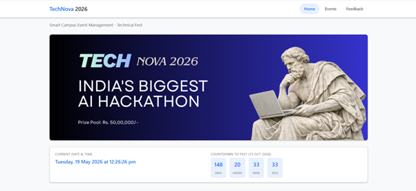
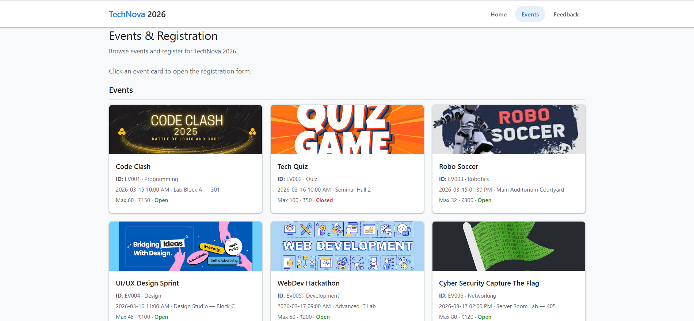
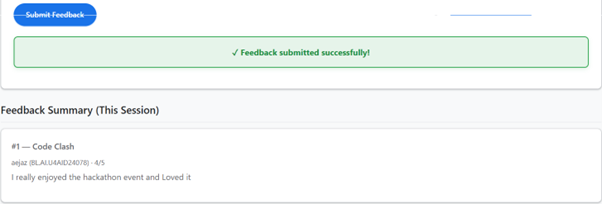
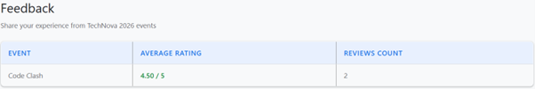

# TechNova 2026 — Smart Campus Event Management

## Team

**Team Number:** 16

| Name | Register No. |
|------|----------------|
| Mutyala Jahnavi Sai | AID24047 |
| Divyesh Shanamugarajah | AID24083 |
| Aejaz Ahmad Ansari | AID24078 |

**Course:** UID — IV Semester  
**Department:** Artificial Intelligence and Data Science (AID)

---

A responsive, multi-page web application for managing a college technical fest — **India's Biggest AI Hackathon** theme — built as part of the **UID (User Interface Design) IV Semester** coursework for **Artificial Intelligence and Data Science (AID)**.

**Repository:** [github.com/jahnavi-1019/Team-16---UID-Hackathon](https://github.com/jahnavi-1019/Team-16---UID-Hackathon)

---

## Overview

**TechNova 2026** is a Smart Campus Event Management portal that lets students explore fest events, register online with validated forms, and submit post-event feedback. The site features a live clock, countdown to fest day, an event dashboard, and session-based registration and feedback tracking — all with a clean, Google-inspired UI suitable for desktop and mobile.

---

## Screenshots

### Home — Live clock & fest countdown

### Events & Registration

Browse event cards, view capacity and fees, and open the registration form with a single click.

### Feedback — Submit & session summary

---

## Features

| Module | Highlights |
|--------|------------|
| **Home** | Hero banner, real-time date/time, countdown to **15 Oct 2026**, event stats (total / open / closed), announcements |
| **Events** | Dynamic event cards (ID, category, schedule, venue, fee, open/closed status), click-to-register flow |
| **Registration** | Client-side validation (name, register no., email, mobile, department, year), individual/team participation, duplicate check, session registration table |
| **Feedback** | Star rating (1–5), comments (min. 20 chars), per-event feedback list, average rating display |
| **UX** | Sticky navigation with active page highlight, mobile hamburger menu, accessible forms and alerts |

> **Note:** Registrations and feedback are stored in **in-memory session arrays** (no `localStorage`) — data resets when the tab is closed, which keeps the demo simple and privacy-friendly for the hackathon.

---

## Tech Stack

- **HTML5** — Semantic structure, ARIA labels, responsive layout
- **CSS3** — Custom properties, flex/grid, mobile-first design
- **Vanilla JavaScript** — DOM manipulation, form validation, live timers, dynamic rendering

No build tools or frameworks required — open and run in any modern browser.

---

## Project Structure
